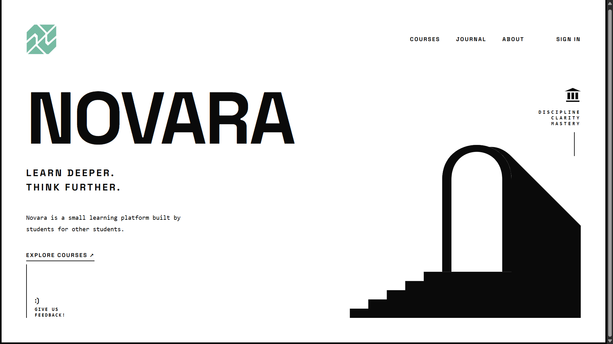
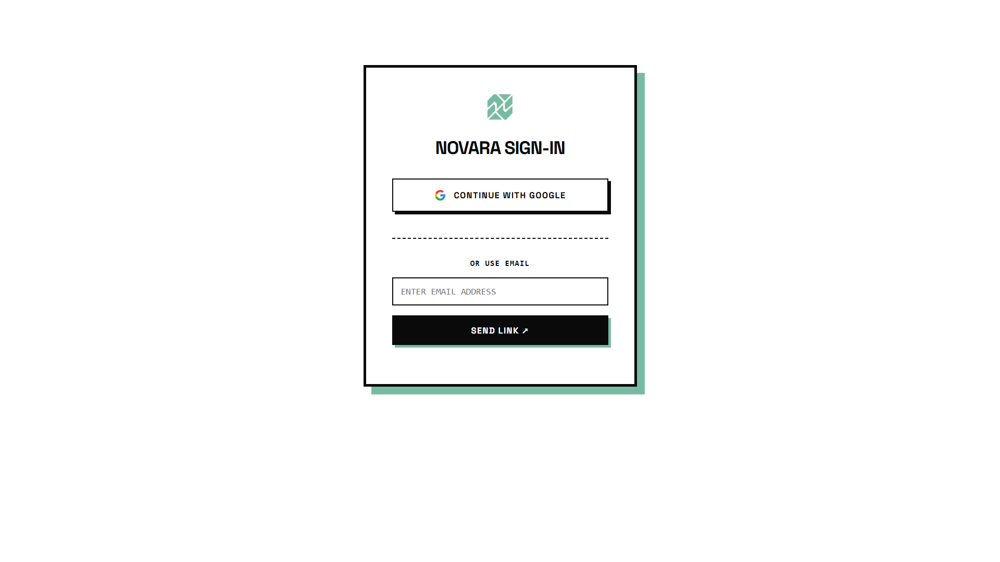
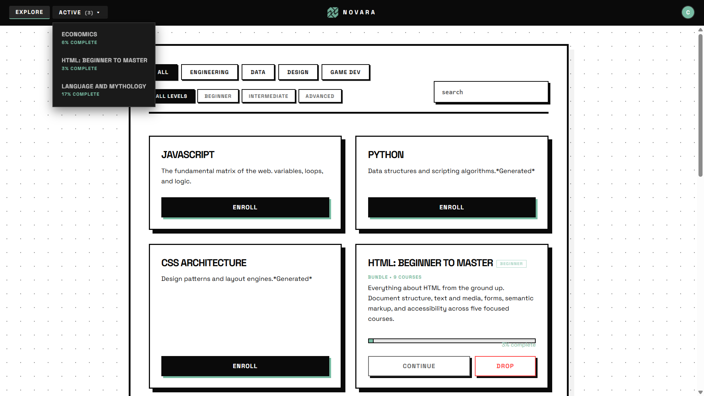
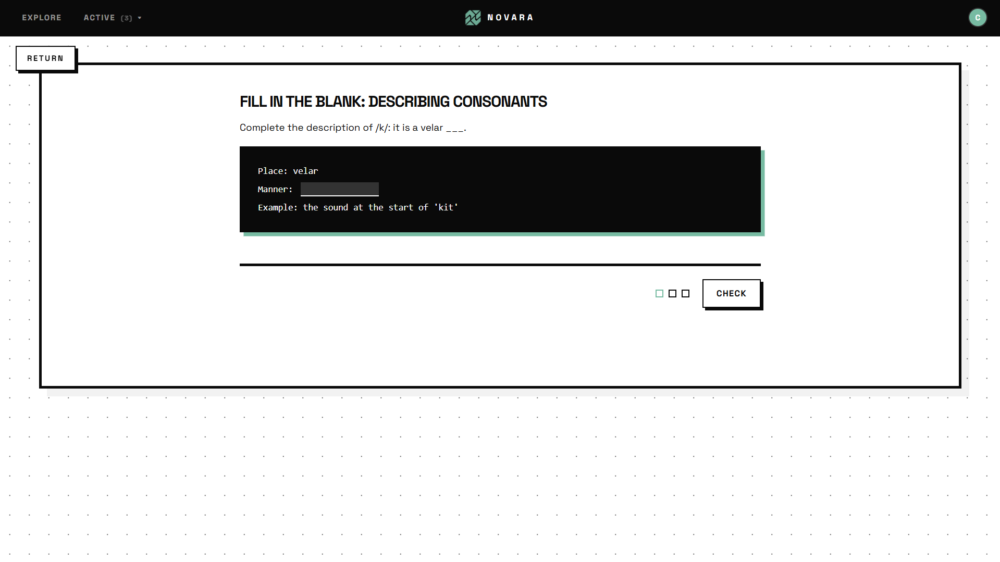
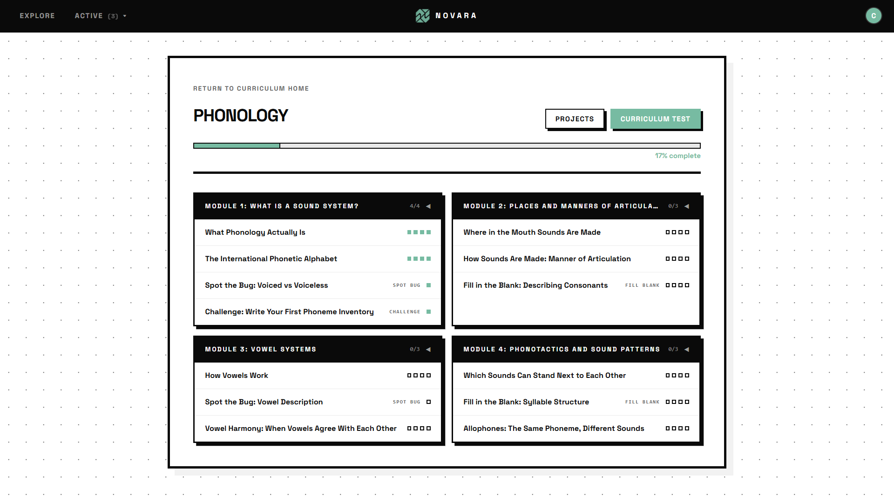

<h1 align="center"> NOVARA - A Gateway To Learning </h1>

#### A free learning website with curriculums and courses on a wide variety of subjects, designed to be accessible to everyone.

***

## Table of Contents
- [Website Usage](#website-usage)
- [Features](#features)
- [Tech Stack](#tech-stack)
- [AI Usage Disclaimer](#ai-usage-disclaimer)
- [Reporting Issues & Support](#reporting-issues--support)
- [Contributing](#contributing)
- [License](#license)

***

## Website Usage

Simply go to [cassetu.github.io/Novara](https://cassetu.github.io/Novara) and start learning! Users will be asked to sign in with Google or use email verification to create an account. This is to allow users to save their progress and access it across devices. We do not use this information for any other purpose.

Learning takes the form in curriculums that the user can enroll in. Each user is limited to a maximum of 3 enrolled curriculums at a time to encourage focus and prevent overwhelm. Each curriculum contains multiple courses, and each course contains multiple lessons. Users can track their progress through the curriculum and courses, and can also take quizzes to test their knowledge.

 
View journal/changelog page: [cassetu.github.io/Novara/html/journal.html](https://cassetu.github.io/Novara/html/journal.html)

Visit About page: [cassetu.github.io/Novara/html/about.html](https://cassetu.github.io/Novara/html/about.html)

Privacy Policy: [cassetu.github.io/Novara/html/privacy.html](https://cassetu.github.io/Novara/html/privacy.html)

## Features
*   **Focused Learning:** Enrollment is limited to a maximum of 3 curriculums at a time to encourage focus and prevent overwhelm.
*   **Structured Content:** Curriculums contain courses, and courses contain modular lessons.
*   **Knowledge Checks:** Built-in quizzes to test your knowledge at the end of courses.
*   **Progress Tracking:** Visual indicators to show completed lessons and remaining coursework.

## Tech Stack
*   **Frontend:** HTML5, CSS3, JavaScript
*   **Backend/Auth:** Firebase Auth / Google Sign-In
*   **Hosting:** GitHub Pages
*   **AI Content Generation:** Claude.ai (for course content generation)

## Reporting Issues & Support
Create an issue on our [GitHub repository](https://github.com/Cassetu/Novara/issues) or email us at **cassetunium@gmail.com** (Responses take 3-5 business days). Please include:
*   A detailed description of the issue.
*   Clear steps to reproduce the bug.
*   Relevant screenshots or console error messages.

## AI USAGE DISCLAIMER

AI is used in the generation of our courses. We have not yet received assistance from subject-matter experts in developing our curricula.

To maintain quality, the AI is guided by strict instructions designed to reduce low-quality content ("slop lessons") and encourage materials that engage students in critical thinking and active learning.

Despite these safeguards, mistakes and errors may still occur. If you find an issue, please report it by emailing: **cassetunium@gmail.com** (Responses take 3-5 business days).

Thank you for helping us improve.

## Contributing
We currently aren't accepting contributions, but we appreciate your interest! If you have suggestions or feedback, please reach out to us at **cassetunium@gmail.com**

## License

The source code for this project is public for viewing and educational purposes only. Unauthorized copying, modification, distribution, or commercial use of this material without explicit written permission from the copyright holder is strictly prohibited.

*Copyright © 2026 Cassetu. All rights reserved.*
