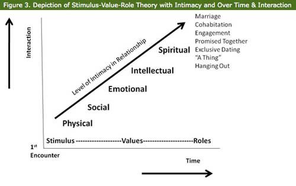
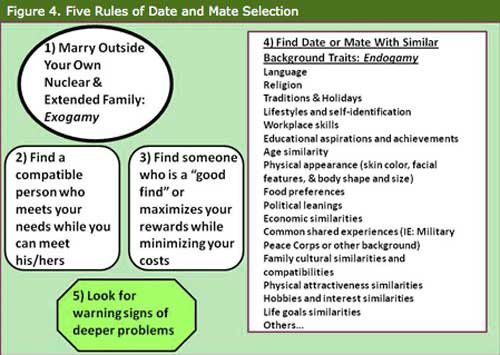
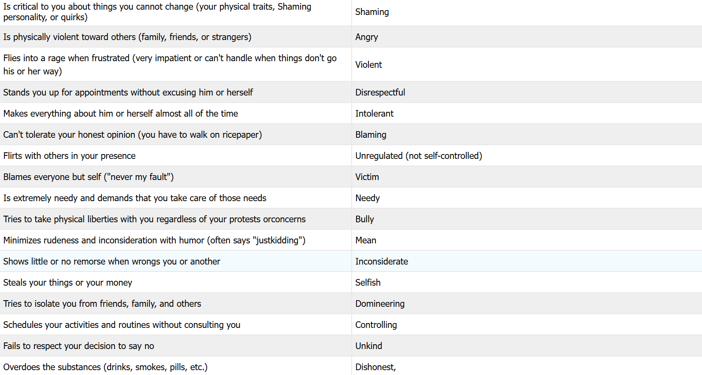
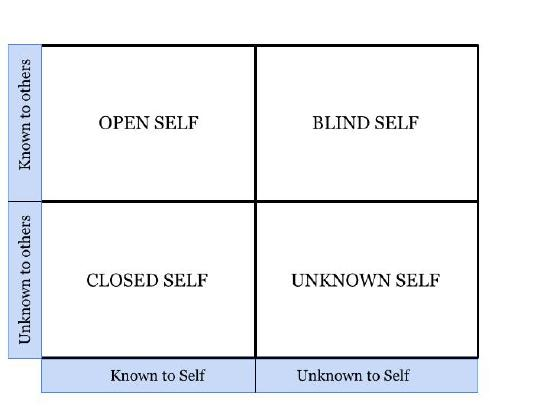
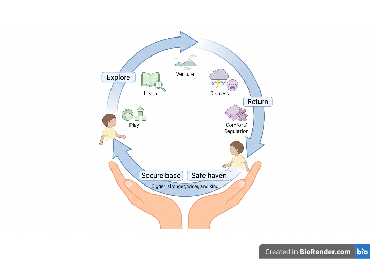
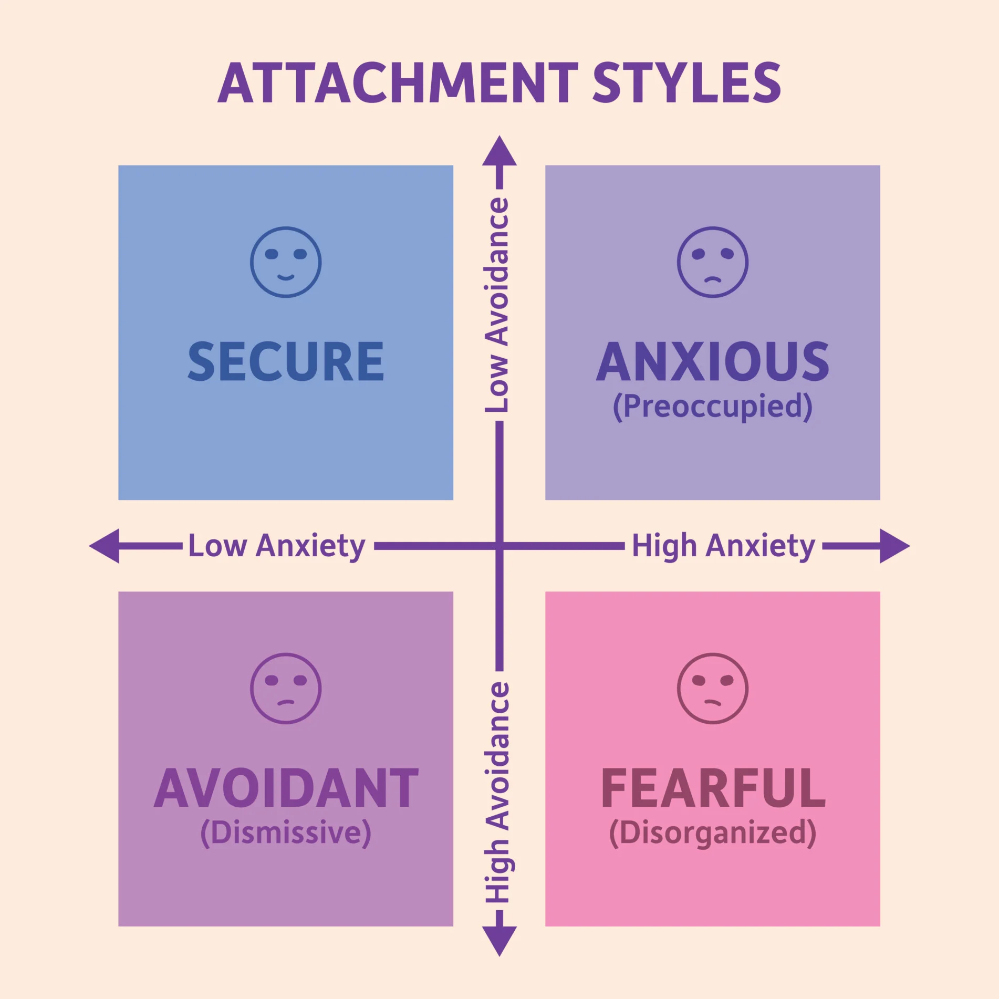

<h1> NOVARA NOTES - The Science of Relationships</h1>

**Written Entirely by Human Hands**, Watch the Timelapses:
* [1.4](https://lapse.hackclub.com/timelapse/PppFJPZGUgEp)
* [1.3](https://lapse.hackclub.com/timelapse/YqlfYCCx08j7)
* [1.2](https://lapse.hackclub.com/timelapse/ir_E9ROtKHUr)
* [1.1](https://lapse.hackclub.com/timelapse/1LwshB7x8AEr)
* [1.0](https://lapse.hackclub.com/timelapse/cPdZpEF6u5YJ)

## Human Attraction & Opportunity
### Halo Effect
“Halo” is a religious concept depicted as a circle of light above the head of a holy saint or person. Much like how an observer of these paintings forms favorable judgments about the people in them, one obvious trait of a person leads an observer to draw a broader conclusion about that person. It could come as rating attractive individuals to also be generous, or a friendly person to be trustworthy, intelligent or capable. This also works in the opposite way, where one negative attribute may induce further negative predisposition toward that person's other aspects, known as the horn effect.
- **Experiment:** Dion, Berscheid and Walster (1972) administered a test on whether physical attractiveness triggers a halo, leading to people connecting the good-looking individuals with better personalities and life prospects. Method: Subjects were presented with pre-rated photos of varying attractiveness levels and asked to evaluate each individual's future marital happiness, fulfillment in life, and job opportunities. Results: Attractive individuals were presumed to possess desirable traits, including honesty, warm-heartedness, and social competence by the participants. Those who were good-looking also were expected to have happier marriages and better, more prestigious jobs. Conclusion: Physical attractiveness sets a broad cognitive bias and reinforces a stereotype of “what is beautiful is good”.
- **Example:** Clifford and Walster (1973) discovered that teachers develop expectations for a child’s academic success and peer relationships from appearance, beyond school records. Teachers were shown several children’s report cards each with a photo of an attractive or unattractive child. Those expectations were all significantly linked to attractiveness.
- **Example:** Hernández-Julián and Peters (2017) compared grading in traditional face-to-face classes with anonymously graded digital courses, where instructors could not see or interact with the physical student. Attractive students earned higher grades in the traditional class, whereas the digital environment showed no bias for grading.
- **Example:** Parrett (2015) examined the impact of beauty and looks on earnings. The data from tipping of restaurants in Virginia showed that attractive servers earned nearly $1,261 more annually in tips than their unattractive counterparts. It was also discovered that customer taste-based discrimination herein mattered more for females than for males.
- **Example:** Landy and Sigall (1974) conducted a study on the impact of the halo effect on male judgements of female academic competence. 60 male undergraduate students were asked to evaluate an essay supposedly written by a first-year female college student. The essay had both poorly written and well-written versions. Out of the 60 participants, 20 were given an additional photo of an unattractive author, and 20 were given the opposite. The remaining 20 weren’t given a photo at all. 30 of the participants read the well-written version, while the others read the poorly written version. Results showed the participants evaluated the writer better when the photo was attractive. Furthermore, the effect of the writer’s attractiveness on the assessment of her writing was most salient when the objective quality of the essay was poor, implying that male readers tolerated poor performance by attractive females over unattractive females.
- **Example:** Sigall and Ostrove (1975) showed it can even flip into a penalty: attractiveness earned leniency for a burglary unconnected to looks, but a harsher sentence once the crime looked like it exploited that same attractiveness.
A view on the cause of the effect holds that people simply average the emotional tone of each piece of information they receive, so a strongly positive item drags the overall rating upward regardless of any coherent story being told. Another view follows implicit personality theories: everyday, shared assumptions that certain traits “go together,” such as attractive-therefore-sociable. These views are not mutually exclusive.
### Mere Exposure Effect
The effect where people who are exposed to a stimulus multiple times, gain a tendency to like it.
- **Example:** Researchers tested this effect by asking participants to look at various stimuli and report their feelings toward the stimuli.Results showed that the more they are exposed to a stimuli, the more familiar it becomes, even happening outside our conscious awareness.
- **Example:** A person listening to a new type of music, dressing with a new fashion trend. At first the music or fashion can feel unnatural, but over repeated exposure that person may find themselves more accepting of it even to the point of liking it.
- **Example:** Robert Zajonc observed that exposure to a novel stimulus initially elicits fear/avoidance in all organisms. But each subsequent exposure causes less fear and more interest. After continual exposure, the observing organism will begin to react fondly to the stimulus.
### Propinquity Effect
This refers to people's tendancy to form bonds with people they encounter frequently, such as neighbors, coworkers, classmates, etc.
- **Example:** Consider friendships that you formed in your life due to the simple presence of the other person.
- **Example:** An early research on the effect revealed that the closer students lived to each other in a dorm, the more likely they were to become friends. In one study, 41% of people were friends with their neighbors, while under 25% had a friend who was several doors down, and only 10% were friends with someone at the end of their hall.
- It seems that the liking peaks after about 10-20 exposures in studies looking at mere exposure to stimuli. Excessive exposure can also offer opposite results.
### Social Exchange Theory
Is the theory that explains how people behave in relationships by using cost-benefit analysis to determine risks and benefits.
- **Example:** Rewards - Cost = Choice
- **Example:** Bernard Murstein (1970) wrote articles where he tested his Stimulus-Value-Role Theory of marital choice. To Murstein the exchange is mutual, depending upon subjective attractions and subjective assets and liabilities both parties bring. Usually the first stimulus is a physical trait, then later on values are compared for compatibility and the evaluation of "Rewards - Cost" to make a choice. After time and relational compatibility supports it, the pair may choose to take roles (boyfriend, wife, etc.) usually including cohabitation, engagement, or marriage.

- As the relationship advances beyond first dates or interactions, the pair may develop "A Thing", then beyond that is a DTR. A DTR is known as "Define the Relationship", where the individuals openly determine if they want to include each other in a specific goal-directed destination (i.e., exclusive dating) or if it's better if the relationship ends.
- These are some rules that can summarize how we include dates or mates in our pool of eligibles:

- Marriage gradient: Tendency for women to marry a man slightly older and slightly taller, while men tend to marry a woman slightly more attractive.
- Marriage Squeeze: Demographic imbalance in the number of males to females among marrying ages.
- Various unhealthy traits in potential Dates and Mates:

> Perera, Ayesh. "Halo Effect In Psychology: Definition and Examples." Simply Psychology, 27 July 2026, https://www.simplypsychology.org/halo-effect.html. Accessed 11 Aug. 2026.
>
> “The Role of Familiarity in Attraction.” Psychology Today, 2022, https://www.psychologytoday.com/us/blog/between-you-and-me/202203/the-role-of-familiarity-in-attraction. Accessed 12 Aug. 2026.
>
> Bornstein, Robert F. (1989). "Exposure and affect: Overview and meta-analysis of research, 1968-1987". Psychological Bulletin. 106 (2): 265–289. doi:10.1037/0033-2909.106.2.265. Accessed 12 Aug. 2026.
>
> Zajonc, Robert B. (1968). "Attitudinal Effects Of Mere Exposure" (PDF). Journal of Personality and Social Psychology. 9 (2, Pt.2): 1–27. doi:10.1037/h0025848. ISSN 1939-1315. Accessed 12 Aug. 2026.
>
> Festinger, L., Schachter, S., Back, K., (1950). The Spatial Ecology of Group Formation, in L. Festinger, S. Schachter, & K. Back (eds.), Social Pressure in Informal Groups. MIT Press. Accessed 12 Aug. 2026.
>
> Physical attractiveness and marital choice. (1972). Journal of Personality and Social Psychology, 22(1), 8-12; Who will marry whom? Theories and research in marital choice. (1976). New York; Springer. Accessed 12 Aug. 2026.
>
> Wikipedia Contributors. “Mere-Exposure Effect.” Wikipedia, Wikimedia Foundation, 28 Mar. 2019, https://en.wikipedia.org/wiki/Mere-exposure_effect. Accessed 12 Aug. 2026.
>
> Wikipedia Contributors. “Social Exchange Theory.” Wikipedia, Wikimedia Foundation, 27 Mar. 2019, https://en.wikipedia.org/wiki/Social_exchange_theory. Accessed 12 Aug. 2026.
>
>“Welcome To Zscaler Directory Authentication.” Libretexts.Org, 2026, https://socialsci.libretexts.org/Bookshelves/Sociology/Marriage_and_Family/Intimate_Relationships_and_Families/05%3A_Dating_and_Mate_Selection/5.01%3A_Theories_of_Mate_Selection. Accessed 12 Aug. 2026.

## Stage Models & Communication
### Knapp’s Relationship Model
Mark Knapp and Anita Vangelisti (2009) looked at how relationships come together, how they are maintained, and how they come apart. They divided relationships into 10 stages.
This list shows a specific order, but they are not always experienced in such linear way.

| 	Process             | 	Stage                                                                                   |
|----------------------|------------------------------------------------------------------------------------------|
| 	  *Coming Together* | - Initiating - Experimenting - Intensifying - Integrating - Bonding      |
| 	  *Coming Apart*    | - Differentiating - Circumscribing - Stagnating - Avoiding - Terminating |

Knapp and Vangelisti's (2009) model separates two distinct phases: coming together and coming apart.
### *Coming Together*
#### Initiating
When we encounter a new person, we decide if we want to put in the energy and initiative to make contact or start a conversation. Initiation can come in many forms, either through a smile, a conversation, etc.
#### Experimenting
At this stage, you are considering if you want to continue the relationship and get to know the other person. Where you start to learn about the person on a deeper, more personal level. Interactions tend to be casual, with reciprocal questions to find common ground or shared interests, aka experimenting.
#### Intensifying
Once you decide to continue the relationship, we typically move into the intensifying stage. During this stage, both parties share more personal and intimate information about themselves. Conversations become more serious, and interactions more meaningful and deep.
#### Integrating
In this stage, they let others know they are dating exclusively, and friends are more likely to invite both people over for dinners or events rather than one or the other.
#### Bonding
The final stage is known as bonding, where people reveal their relationship to the world, such as a formal engagement, wedding ceremony, or social media post.
### *Coming Apart*
#### Differentiating
This is a process of disengaging. This is where communication is used to purposefully divide the relationship.
#### Circumscribing
To circumscribe means to limit something. When people circumscribe in a relationship. Communication decreases and subjects become restricted as individuals verbally close themselves off from each other. In the form of silence or passive-aggressive behaviour.
#### Stagnating
When a relationship has stagnated, it feels like it has come to a halt. In some cases, verbal communication slows and is often avoided and the relationship feels strained.
#### Avoiding
In the avoidance stage, people stay out of each other's physical space. And when that actual physical avoidance cannot take place, people will simply avoid each other while they're together and treat the other as if they don't exist. Both parties will separate from one another physically, emotionally, and mentally.
#### Terminating
There are many reasons why a relationship may terminate. It can result from outside circumstances, such as geographic separation or internal factors, such as changing values or personalities. Termination may occur through the exchange of verbal or nonverbal messages. One example of nonverbal termination is called ghosting, where one person disappears unexpectedly and never communicates with the other again. Death is also a cause of terminating.
### Social Penetration Theory
Relationships evolve from superficial interactions to intimate bonds through expansion of communication boundaries. Social Penetration Theory describes this progression as the "onion metaphor" in regard to the layers of personality.
- *Breadth:* The broad variety of topics discussed within a relationship.
- *Depth:* The degree of intimacy or privacy involved in the shared information.
Early-stage interaction remain high breadth and very low depth. As trust increases, the vulnerability of deeper layers becomes a tool for strengthening theemotional connection between individuals.
#### Principle of Reciprocity
Attraction depends heavily upon the "norm of reciprocity" aka an equitable exchange of personal information. Without the balance, there can exist power vacuums or feelings of insecurity. Stable bonds require a "tit-for-tat" pattern of vulnerability.
#### Social Appropriateness
The impact of disclosure is mediated by how the recipient perceives the sender's motivations. Sharing a secret because they view another as uniquely trustworthy increases attraction, but "indiscriminate disclosure" leads to a decrease in liking. 

Appropriateness also dictates the success of a disclosure. Sharing extremely intimate details too early violates social norms. Oversharing in this case can be perceived as emotional instability or poor social judgement. Effective self-disclosure follows a gradual pace that matches the current level of commitment.
#### Sprecher and Hendrick (2004) - Relationship Quality
Investigated the relationship between self-disclosure and relationship satisfaction among heterosexual dating couples.
- **Method:** A longitudinal study was conducted with 101 dating couples. Participants were asked to complete self-report scales measuring levels of disclosure, satisfaction, and commitment
- **Result:** Strong positive correlations were found between self-disclosure and measures of love and commitment. Showing that self-disclosure is a robust predictor of relationship stability and emotional satisfaction.
#### Tang et al. (2013) - Cultural Variations in Disclosure
Examined cultural differences in self-disclosure patterns between individualist and collectivist societies.
- **Method:** Literature reviews and cross-cultural surveys were utilized to compare participants from the USA and China. Responses regarding sexual self-disclosure and relationship satisfaction were analyzed.
- **Result:** US participants disclosed significantly more sexual thoughts and feelings than Chinese participants. In China, higher relationship satisfaction was often associated with low levels of self-disclosure. This shows that the link between self-disclosure and satisfaction is not universal, cultural norms dictate the "best" level of openness within a romantic bond.
#### ***Critical Evaluation***
Research on self-disclosure often faces the "direction of causality" problem. Many studies are correlational rather than experimental. In the way that disclosure might cause attraction, it is equally possible that existing attraction causes people to disclose more. And the data relies heavily on self-report data. Which leads to social desirability bias, distorting the reports.
### Evolutionary Explanation for Physical Attractiveness
From an evolutionary perspective, physical features we find appealing are due to signals of reproductive success and genetic fitness.
#### The Handicapping Principle (Zahavi, 1975)
Aimed to explain why animals develop cumbersome traits that seem to hinder survival.
- **Method:** Observations of diverse species, such as peacocks. Used to analyze trait selection.
- **Result:** Superior males were discovered to maintain costly physical traits that proved vigor to mates. High-quality individuals can affort to "waste" energy on beauty, signaling genetic strength.
#### Cross-Cultural Mate Preferences (Buss, 1989)
Researched many diverse human populations to find universal trends in mate selection.
- **Method:** Over 10,000 participants from 37 different cultures were surveyed regarding preffered partner traits.
- **Result:** Men universally valued physical appearance more than women did in every culture studied. Whereas women valued cues to resource acquisition more highly than males. Showing that evolutionary pressures regarding fertility and resources are consistent across the global human population.
### Johari Window
The Johari window is a useful tool in examining self-disclosure in relationships. It examines what information we have about ourselves, as well as the information others know about us.

#### Open Self
The Open Self represents the parts of ourselves we know well and share with others. Items such as your name, hobbies, likes, and dislikes.
#### Closed Self
The Closed Self represents the part of ourselves we know well, but we choose to keep secret or not tell others. 
#### Blind Self
The Blind Self represents the parts of ourselves that other people know well, yet we are unaware of this information about ourselves.
#### Unknown Self
The Unknown Self represents the parts of ourselves that no one knows. Sometimes this information is buried deep into our subconscious, due to trauma or childhood events.
### Uncertainty Reduction Theory (URT)
URT states that we pursue knowledge about others in order to reduce or resolve anxiety associated with the unknown. According to URT, humans use three basic strategies: passive, active, and interactive.
#### Passive Strategy
This refers to observing someone from afar.
#### Active Strategy
This involves getting information about the person from a secondary source, generally a friend, family member, or co-worker.
#### Interactive Strategy
This focuses on the direct exchange of information with the other person.
> Weidner, Eric, et al. “10.4: Relationship Stages.” Social Sci LibreTexts, 8 Mar. 2022, https://socialsci.libretexts.org/Bookshelves/Communication/Interpersonal_Communication/Interpersonal_Communication%3A_Context_and_Connection-OERI/10%3A_Building_and_Maintaining_Relationships/10.04%3A_Relationship_Stages. Accessed 13 Aug. 2026.
>
> “6.1: Foundations of Relationships.” Social Sci LibreTexts, 14 July 2020, https://socialsci.libretexts.org/Courses/College_of_the_Canyons/COMS_246%3A_Interpersonal_Communication_(Leonard)/6%3A_Communication_in_Relationships/6.1%3A_Foundations_of_Relationships. Accessed 13 Aug. 2026.
>
> Mark L. Knapp and Anita L. Vangelisti, Interpersonal Communication and Human Relationships (Boston, MA: Pearson, 2009) Accessed 13 Aug. 2026.
> 
> Goulder, Will. “A-Level Psychology Relationship Revision for Paper 3 | Simply Psychology.” Simplypsychology.Org, 2019, https://www.simplypsychology.org/a-level-relationships.html. Accessed 13 Aug. 2026.
> 
> Altman, I., Taylor, D. A., & Actman, I. (1973). Social penetration: The development of interpersonal relationships (2nd ed.). New York: Holt, Rinehart and Winston. Accessed 13 Aug. 2026.
> 
> Anderson, C., Keltner, D., & John, O. P. (2003). Emotional convergence between people over time. Journal of Personality and Social Psychology, 84(5), 1054–1068. doi:10.1037/0022-3514.84.5.1054 Accessed 13 Aug. 2026.
>
> Aron, A., Melinat, E., Aron, E. N., Vallone, R. D., & Bator, R. J. (1997). The experimental generation of interpersonal closeness: A procedure and some preliminary findings. Personality and Social Psychology Bulletin, 23(4), 363–377. doi:10.1177/0146167297234003 Accessed 13 Aug. 2026.
>
> Buss, D. M. (1989). Sex differences in human mate preferences: Evolutionary hypotheses tested in 37 cultures. Behavioral and Brain Sciences, 12(01), 1. doi:10.1017/s0140525x00023992 Accessed 13 Aug. 2026.
> 
> “7.4: Self-Disclosure and Interpersonal Communication.” Social Sci LibreTexts, 2 July 2019, https://socialsci.libretexts.org/Under_Construction/Purgatory/Survey_of_Human_Communication/07%3A_Interpersonal_Communication_Processes/7.4%3A_Self-Disclosure_and_Interpersonal_Communication. Accessed 13 Aug. 2026.
> 
> “6.1: Foundations of Relationships.” Social Sci LibreTexts, 14 July 2020, https://socialsci.libretexts.org/Courses/College_of_the_Canyons/COMS_246%3A_Interpersonal_Communication_(Leonard)/6%3A_Communication_in_Relationships/6.1%3A_Foundations_of_Relationships. Accessed 13 Aug. 2026.
> 
> “2.5: Social Penetration Theory.” Social Sci LibreTexts, 15 May 2020, https://socialsci.libretexts.org/Courses/College_of_the_Canyons/COMS_120%3A_Small_Group_Communication_(Osborne)/02%3A_Reading_Group_Development/2.05%3A_Social_Penetration_Theory. Accessed 13 Aug. 2026.
## Attachment, Love & Social Dynamics
### John Bowlby’s Attachment Theory
This emphasizes the importance of early emotional bonds between a child and their caregivers.
- Children are born with a biological, evolutionary drive to form emotional bonds with others.
- **Monotropy:** A child forms a primary attachment to one main figure that is qualitatively distance and more important than all other subsequent relationships.
- The first 2.5 years of life is the crucial window to develop a bond, otherwise it may result in permanent difficulties later on.
- Prolonged separation from the primary caregiver can result in significant long-term cognitive, social, and emotional challenges for the child.
- Develops a mental framework to guide social relationships.
### Evolutionary Theory of Attachment
Bowlby was greatly influenced by ethological research, primarily Lorenz's (1935) work on imprinting. Lorenz showed that young ducklings imprint on the first moving figure they see, an adaptation that promotes their survival. Bowlby (1969, 1988) recognized parallels in human infants, arguing that attachment behaviors evolved because babies who stayed close to a responsive caregiver were more likely to survive.
### Ethology and the Evolutionary Basis of Attachment
Infants rely on caregivers for protection, comfort, and security. Parents, especially mothers, are driven to respond sensitively to their infants' signals. This process ensures that children's needs are met and caregiver remains aware of potential threats. Bowlby (1969)described the many attachment behaviors as instinctive (e.g., crying, clinging, etc.) Activating when proximity to the caregiver is threatened. He further noted that fear of strangers is also an innate survival mechanism.
### Secure Base
A secure base is simultaneously a role the caregiver plays and an internalized feeling of security within the child. Emphasizing the caregiver as the anchor of security that lets the child explore. A child with a secure attachment uses their caregiver as the point of safety, so they can confidently return to the caregiver if faced with danger or distress.

#### How it works:
- When a caregiver is consistently responsive and sensitive to a child's needs, the child develops a sense of trust and security.
- The security allows the child to venture and explore, knowing that return to a safe haven exists.
- The availability of the caregiver fosters the child's independence and confidence.
- Returning to a familiar, comforting figure replenishes the child's emotional balance, so each cycle of exploration grows the child's confidence and sense of mastery.
### Beyond Infancy: Adolescence and Adulthood
- **Adolescence:** Teens benefit from knowing help and advice are available for major decisions or emotional struggles.
- **Adult Partnerships:** Romantic partners often adopt secure-base functions for one another, offering emotional and practical support to benefit each person.
- **Clinical/Therapeutic:** Therapists act as temporary attachment figures, providing a secure base that lets clients explore painful memories and gradually reorganize their internal working models.

### Maternal Deprivation Hypothesis
Bowlby suggests that continual attachment disruption between the infant and primary caregiver leads to significant long-term harm. This hypothesis is founded on the idea of monotropy. These are the primary effects initially believed to be permanent and irreversible:
- Delinquency
- Reduced intelligence
- Increased aggression
- Depression
- Affectionless psychopathy, Characterized by a lack of concern for others, lack of guilt, and inability to form meaningful relationships.
### Bowlby 44 Thieves
Bowlbly studied 44 adolescent juvenile delinquents in a child guidance clinic. Aimed to investigate the long-term effects of maternal deprivation on people to see whether delinquents have suffered deprivation.
- **Method:** 1936-1939, Bowlbly selected a sample of 88 children from his work clinic. 44 of them were juvenile thieves (31 boys and 13 girls) who had been referred to him because of their theft. Another 44 were selected (34 boys and 10 girls) to act as the control group. Upon arrival, each child had their IQ tested by a psychologist who assessed their emotional attitudes toward the tests. The two groups were matched for age and IQ. The child and their parents were interviewed to record details of the child's early life (e.g., periods of separation, affectionless psychopathy) by Bowlbly, a psychologist, and a social worker. All 3 made separate reports.
- **Results:** Bowlby found that 14 children from the thief group were identified as affectionless psychopaths. Of these, 12 had experienced prolonged separation of more than six month from their mothers in their first two years of life. In contrast, only 5 of the 30 children not classified as affectionless psychopaths had experienced separations. Out of 44 children in the control group, only two experienced prolonged separations, and none were affectionless psychopaths. This supported the maternal deprivation hypothesis
- **Limitations:** Bowlby's evidence asked participants to recall past separation, which risks inaccurate memories. Rutter (1972) pointed out that Bowlby's conclusions confused correlation with causation; other factors could have been involved. Many of the 44 theives had been moved around repeatedly during childhood, and likely never formed an attachment. Rutter (1972) argued that this meant they suffered from privation rather than deprivation. There are also issues of researcher bias.

Cautious of these issues, Bowlby, Robertson, and Mary Ainsworth began a follow-up study on whether long-term hospitalized preschoolers later developed conduct issues. They accessed 60 such children aged 6-13 and controls, they found more emotional apathy, withdrawal, and poor self-control contrary to criminality and original maternal deprivation predictions. The outcomes proved far more varied than Bowbly's theory had predicted, and the improved prospective method exposed the limits of his earlier retrospective approach. Bowlby himself later admitted that his theory of conduct problems may have been incorrect.

### Short-Term Separation
John Bowlby later spent two years working alongside a social worker, James Robertson (1952). They found three progressive stages of distress in children experiencing maternal separation.
1. Protest, including cries, screams and clings lasting from hours to days.
2. Despair, the protest fades into a calmer, unhappy withdrawal. Refusing comfort from others and experiencing uninterest of their surroundings.
3. Detachment, the child re-engages with other people while suppressing all feelings. They may look happy on the surface, but frequently ignore their parent's visits and no longer reacts when she leaves. Robertson termed denial, but Bowlby called detachment.
#### A Two-Year-Old Goes to Hospital
Doctors saw the despair phase as adjustment, but Bowlby felt it showed distress's harm. To demonstrate, Robertson filmed two-year-old Laura's distress when hospitalized for eight days for minor surgery in “A Two-Year-Old Goes to Hospital” (1952). It Captured her severe distress resulting from maternal separation and the unfamiliar hospital setting. Laura's behaviors directly mirrored Bowlby and Robertson's three-phase separation response. Disproving the assumption that children easily adapt to hospital environments, and instead highlighting the emotional toll of physical separation.
### Internal Working Model (IWM)
Bowlby proposed that early infant-caregiver interactions form a permanent cognitive template.
#### The Three Core Pillars
The IWM is a subconscious cognitive framework built on three interconnected beliefs.
- **Model of Self:** "Am I valuable, competent, and worthy of love?" (Determined by how much the caregiver validated their needs).
- **Model of Others:** "Are other people reliable, trustworthy, and likely to help me?" (Determined by the caregiver's consistency).
- **Model of Interaction:** "How do I successfully get my needs met?" (Determined by what worked in childhood)

### Adult Attachment Styles (Secure vs. Insecure)
#### Two Dimensions of Attachment
Adult attachment is measured on two scales: Anxiety and Avoidance. These dimensions create four distinct profiles: Secure (L/L), Anxious(H/L), Avoidant(L/H), and Disorganized(H/H).
#### Secure Attachment
- Trust, stability, and a balance of intimacy and autonomy.
- Positive view of self and others.
- Relationship Behavior: Open communication, comfortable with emotional closeness, and adaptive conflict resolution. They don't panic when their partner needs space, nor do they pull away when their partner needs support.
#### Anxious Attachment
- Fear of abandonment and a constant need for reassurance.
- Negative view of self but positive view of others.
- Relationship Behavior: Overly dependent. Uses "protest behaviors" to get attention when they feel their partner pulling away.
#### Avoidant Attachment
- Emotional distancing and fierce self-reliance as a protective measure.
- Positive view of self but negative view of others.
- Relationship Behavior: Suppresses their emotional needs and struggle to communicate feelings. Uses "deactivating strategies" when someone gets too close
#### Disorganized Attachment
- Chaotic "push-pull" dynamic, often rooted in past trauma or highly inconsistent childhood caregiving.
- Fluctuating view of self and negative/mixed view of others.
- Relationship Behavior: Crave intimacy, but are terrified of it. Resulting in erratic behavior, seeking closeness one moment and aggressively pushing their partner away the next.

### Sternberg's Triangular Theory of Love
#### The Three Core Components
According to Robert Sternberg, love is not a single emotion, but a combination of three distinct, foundational elements:
- **Intimacy:** The emotions, involving closeness, vulnerability and deep connection. (Builds slowly over time).
- **Passion:** The physical drive, involving romance, physical attraction, and sexual arousal (Peaks quickly and levels off).
- **Commitment:** The cognitive choice, involving the initial decision to love someone and the long-term dedication to maintain that bond (Remains stable over time).
#### 8 Types of Love
1. Nonlove: The absence of all three components.
2. Friendship: Intimacy.
3. Infatuation: Passion.
4. Empty Love: Commitment
5. Romantic Love: Passion and Intimacy.
6. Companionate Love: Intimacy and Commitment.
7. Fatuous Love: Passion and Commitment.
8. Consummate Love: The ideal, healthy romantic relationship with all three components present.
#### Limitations
Sternberg's model is fundamentally a cognitive model exclusive on the internal, psychological states of the two individuals involved. It does not factor in the influence, behaviors, or external pressures.

The theory is limited in scope, and may not be as solid when applied to further less structured human relationships.

The model is also rooted in a Western, individualistic understanding of love and marriage.

And a broader criticism, theories of love face inherent methodological challenges. Such as scientifically measuring and analyzing complex, deeply subjective feelings like passion and intimacy. Unlike studies of initial attraction where researchers can easily manipulate variables, researchers cannot assign people to be in long-term "lover" conditions.
### Social Exchange Theory (SET)
People unconsciously apply economic principles to their relationships. We are driven to maximize our rewards and minimize our costs. Maintaining relationships when the rewards outweigh the costs, and abandoned otherwise. Rewards and costs are highly subjective.
#### Four Stages of Relationship Development
According to Thibaut and Kelley, relationships evolve through an economic process:
1. Sampling (Evaluate potential costs and benefits)
2. Bargaining (Exchange costs and benefits to find a balanced dynamic)
3. Commitment (Stabilization)
4. Institutionalization (The couple settle down.)
#### The Two Levels of Comparison
People don't just calculate profit, but rather have two internal benchmarks.
- Comparison Level: "What do I deserve?" This is based on past relationship experiences, self-esteem, and social/media conditioning.
- Comparison Level for Alternatives: "Could I do better elsewhere?" Weigh your current relationship against the potential profit of being single or being with someone else.
#### Strengths & Limitations
- **Strengths:** SET explains why people stay in objectivly bad or abusive relationships, such as a low Comparison Level, or low Camparison Level for Alternatives. Longitudinal studies (e.g., Rusbult, 1983) show that relationship commitment is highly predicted by evaluating satisfaction, investments, and alternatives.
- **Limitations:** SET assumes people just want to maximize their own profit. However, research (e.g., Hatfield, 1989) shows that over-benefits often feel guilty and uncomfortable, Humans actually seek fairness and more than just raw profit. It also reduces human love to a selfish, cold calculation. It struggles to explain pure altruism or people willingly making massive sacrifices for a partner without expecting an immediate "return on investment."

> McLeod, Saul. “John Bowlby’s Attachment Theory.” Simply Psychology, 20 Apr. 2025, https://www.simplypsychology.org/bowlby.html. Accessed 14 Aug. 2026.
> 
> Drescher, Anna. “Insecure vs. Secure Attachment in Relationships.” Simply Psychology, 5 July 2023, https://www.simplypsychology.org/insecure-vs-secure-attachment-in-relationships.html. Accessed 15 Aug. 2026.
> 
> Candel, O.S. & Turliuc, M.N. (2019). Insecure attachment and relationship satisfaction: A meta-analysis of actor and partner associations. Personality and Individual Differences, 147: 190-199. Accessed 15 Aug. 2026.
> 
> Candel, O. S., and M. N. Turliuc. "Insecure Attachment and Relationship Satisfaction: A Meta-Analysis of Actor and Partner Associations." Personality and Individual Differences, vol. 147, 2019, pp. 190–199. https://doi.org/10.1016/j.paid.2019.04.037. Accessed 15 Aug. 2026.
>
>Olufowote, R. A. D., et al. "How Can I Become More Secure? A Grounded Theory of Earning Secure Attachment." Journal of Marital and Family Therapy, vol. 46, no. 3, 2020, pp. 489–506. https://doi.org/10.1111/jmft.12409. Accessed 15 Aug. 2026.
>
>Schachner, D. A., et al. "Adult Attachment Theory, Psychodynamics, and Couple Relationships." Attachment Processes in Couple and Family Therapy, edited by Susan M. Johnson and Valerie E. Whiffen, Guilford Press, 2003, pp. 18–42. Accessed 15 Aug. 2026.
>
>Sheinbaum, T., et al. "Attachment Style Predicts Affect, Cognitive Appraisals, and Social Functioning in Daily Life." Frontiers in Psychology, vol. 6, 2015, p. 296. https://doi.org/10.3389/fpsyg.2015.00296. Accessed 15 Aug. 2026.
>
>Simpson, J. A., and W. S. Rholes. "Adult Attachment, Stress, and Romantic Relationships." Current Opinion in Psychology, vol. 13, 2017, pp. 19–24. https://doi.org/10.1016/j.copsyc.2016.04.006. Accessed 15 Aug. 2026.
> 
> Myers, Eleanor. “Sternberg’s Triangular Theory and the 8 Types of Love.” SimplyPsychology, 6 Dec. 2023, https://www.simplypsychology.org/types-of-love-we-experience.html. Accessed 15 Aug. 2026.
> 
> Deverich, S. "Love Unveiled: Teenage Love within the Context of Sternberg’s Triangular Theory of Love." Intuition, vol. 5, 2009, pp. 21–25. Accessed 15 Aug. 2026.
>
> Lemieux, R., and J. L. Hale. "Intimacy, Passion, and Commitment in Young Romantic Relationships: Successfully Measuring the Triangular Theory of Love." Psychological Reports, vol. 85, no. 2, 1999, pp. 497–503. Accessed 15 Aug. 2026.
>
> Lemieux, R., and J. L. Hale. "Intimacy, Passion, and Commitment among Married Individuals: Further Testing of the Triangular Theory of Love." Psychological Reports, vol. 87, no. 3, 2000, pp. 941–948. Accessed 15 Aug. 2026.
>
> Sternberg, R. J. "A Triangular Theory of Love." Psychological Review, vol. 93, no. 2, 1986, p. 119. Accessed 15 Aug. 2026.
>
> Sternberg, R. J. "Liking versus Loving: A Comparative Evaluation of Theories." Psychological Bulletin, vol. 102, no. 3, 1987, p. 331. Accessed 15 Aug. 2026.
> 
> Nickerson, Charlotte. “Social Exchange Theory - Simply Psychology.” Www.Simplypsychology.Org, 25 Oct. 2023, https://www.simplypsychology.org/what-is-social-exchange-theory.html. Accessed 15 Aug. 2026.
# Personal Curriculum Notes
- [ ] Make questions where a small excerpt of a relationship is shown, and the user is tasked with categorizing it. (Specifically for [Johari Window](https://socialsci.libretexts.org/Bookshelves/Communication/Interpersonal_Communication/Interpersonal_Communication%3A_Context_and_Connection-OERI/10%3A_Building_and_Maintaining_Relationships/10.05%3A_The_Role_of_Self-Disclosure#:~:text=and%20culture%3F-,Johari%20Window,-The%20Johari%20window), Knapp's Relationship Model, 8 Types of Love)